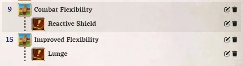

# FoundryVTT PF2e Dailies

This module will provide a convenient interface to handle a character's daily preparations if they have at least one of the following feats or items:

Language related

-   [Ancestral Linguistics](https://2e.aonprd.com/Feats.aspx?ID=1407)
-   [Bort's Blessing](https://2e.aonprd.com/Equipment.aspx?ID=476)

Skill related

-   [Ancestral Longevity](https://2e.aonprd.com/Feats.aspx?ID=12)
-   [Ageless Spirit](https://2e.aonprd.com/Feats.aspx?ID=2393)
-   [Ancient Memories](https://2e.aonprd.com/Feats.aspx?ID=3944)
-   [Flexible Studies](https://2e.aonprd.com/Feats.aspx?ID=1446)

Feat related

-   [Combat Flexibility](https://2e.aonprd.com/Classes.aspx?ID=7)
    -   [Improved Flexibility](https://2e.aonprd.com/Classes.aspx?ID=7)

Scroll related

-   [Scroll Savant](https://2e.aonprd.com/Feats.aspx?ID=652)
-   [Basic Scroll Cache](https://2e.aonprd.com/Feats.aspx?ID=2054)
    -   [Expert Scroll Cache](https://2e.aonprd.com/Feats.aspx?ID=2056)
    -   [Master Scroll Cache](https://2e.aonprd.com/Feats.aspx?ID=2057)
-   [Scroll Esoterica](https://2e.aonprd.com/Feats.aspx?ID=3713)
    -   [Elaborate Scroll Esoterica](https://2e.aonprd.com/Feats.aspx?ID=3720)
    -   [Grand Scroll Esoterica](https://2e.aonprd.com/Feats.aspx?ID=3730)

IMPORTANT: You should always `rest` before your daily preparations, if not, you will most likely encounter some problems. It is also possible that openning the interface too quickly after a `rest` result in the reset not being completed yet and the details shown not up to date.

# Sheet Icon

A new character sheet icon will appear next to the `rest` one, clicking on it will open the daily preparations interface.

# Interface

The interface will look different depending on the feats and items present on the character and its current level.

The interface allows the user to open the compendium browser (with the right settings) and directly drag & drop the appropriate items.

## Scrolls

When a spell is dropped in a spell slot, a temporary spell scroll will be created with the appropriate hightened level directly in the character's inventory.

## Feats

Selected feats are directly added to the character feat tab, in cascade with the related feat that gave the user the choice.

## Items

An item needs to be invested to appear in the interface, the bonus provided is linked to the item itself and like any other bonuses, will be removed if the character un-invest or un-equip the item.

# Chat

A descriptive chat message will be created to indicate what has been prepared.

# Rest

Feats and items that require you to select an options (e.g. skill or language) will be reset on `rest`.

# CHANGELOG

You can see the changelog [HERE](./CHANGELOG.md)
