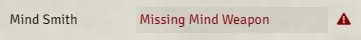
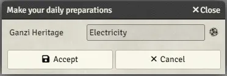
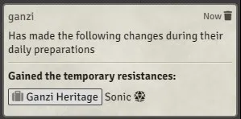

# FoundryVTT PF2e Dailies

[](https://ko-fi.com/K3K6M2V13)

**This module will provide a convenient interface to handle a character's daily preparations, here is a list of built-in features in the module:**

Consuming Rations

-   if the character has any rations available in their inventory, they will be offered the option to consume one.

Familiar Abilities

-   If the character has a familiar, the module will offer the ability to select its abilities.

Language related

-   [Ancestral Linguistics](https://2e.aonprd.com/Feats.aspx?ID=1407)
-   [Bort's Blessing](https://2e.aonprd.com/Equipment.aspx?ID=476)

Skill related

-   [Ancestral Longevity](https://2e.aonprd.com/Feats.aspx?ID=12)
-   [Ageless Spirit](https://2e.aonprd.com/Feats.aspx?ID=2393)
-   [Ancient Memories](https://2e.aonprd.com/Feats.aspx?ID=3944)
-   [Flexible Studies](https://2e.aonprd.com/Feats.aspx?ID=1446)
-   [Quick Study](https://2e.aonprd.com/Feats.aspx?ID=2003)
-   [Thaumaturgy Tome](https://2e.aonprd.com/Implements.aspx?ID=7)

Resistance related

-   [Elementalist Dedication](https://2e.aonprd.com/Feats.aspx?ID=2986)
-   [Ganzi Heritage](https://2e.aonprd.com/Heritages.aspx?ID=129)

Feat related

-   [Combat Flexibility](https://2e.aonprd.com/Classes.aspx?ID=7)
    -   [Improved Flexibility](https://2e.aonprd.com/Classes.aspx?ID=7)
-   [Metamagical Experimentation](https://2e.aonprd.com/ArcaneThesis.aspx?ID=2)

Spell related

-   [Trickster's Ace](https://2e.aonprd.com/Feats.aspx?ID=598)

Scroll related

-   [Basic Scroll Cache](https://2e.aonprd.com/Feats.aspx?ID=2054)
    -   [Expert Scroll Cache](https://2e.aonprd.com/Feats.aspx?ID=2056)
    -   [Master Scroll Cache](https://2e.aonprd.com/Feats.aspx?ID=2057)
-   [Scroll Esoterica](https://2e.aonprd.com/Feats.aspx?ID=3713)
    -   [Elaborate Scroll Esoterica](https://2e.aonprd.com/Feats.aspx?ID=3720)
    -   [Grand Scroll Esoterica](https://2e.aonprd.com/Feats.aspx?ID=3730)
-   [Scroll Savant](https://2e.aonprd.com/Feats.aspx?ID=652)

Mind Smith Dedication

-   [Mind Smith](https://2e.aonprd.com/Archetypes.aspx?ID=194)
    -   [Malleable Mental Forge](https://2e.aonprd.com/Feats.aspx?ID=3868)
    -   [Runic Mind Smithing](https://2e.aonprd.com/Feats.aspx?ID=3870)
    -   [Advanced Runic Mind-Smithing](https://2e.aonprd.com/Feats.aspx?ID=3872)

Divine Ally

-   [Blade Ally](https://2e.aonprd.com/Classes.aspx?ID=4)
    -   [The Tenets of Good](https://2e.aonprd.com/Tenets.aspx)
    -   [The Tenets of Evil](https://2e.aonprd.com/Tenets.aspx)
    -   [Liberator](https://2e.aonprd.com/ClassSamples.aspx?ID=8)
    -   [Paladin](https://2e.aonprd.com/Causes.aspx?ID=1)
    -   [Antipaladin](https://2e.aonprd.com/Causes.aspx?ID=6)
    -   [Tyrant](https://2e.aonprd.com/Causes.aspx?ID=4)
    -   [Radiant Blade Spirit](https://2e.aonprd.com/Feats.aspx?ID=240)
    -   [Radiant Blade Master](https://2e.aonprd.com/Feats.aspx?ID=262)
    -   The system's `Effect: Blade Ally` isn't needed anymore

Others

-   [Root Magic](https://2e.aonprd.com/Feats.aspx?ID=2147)

# Sheet Icon


A new character sheet icon will appear next to the `rest` one, clicking on it will open the daily preparations interface.

# Interface


The interface will look different depending on the feats and items present on the character and its current level.

The interface allows the user to open the compendium browser (with the right settings) and directly drag & drop the appropriate items.

## Scrolls

When a spell is dropped in a spell slot, a temporary spell scroll will be created with the appropriate hightened level directly in the character's inventory.

## Spells

When needed, a spellcasting entry will also be created to house the added spells.

## Feats


Selected feats are directly added to the character feat tab, in cascade with the related feat that gave the user the choice.

## Equipment

Equipment items need to be invested to appear in the interface, the bonus provided is linked to the item itself and like any other bonuses, will be removed if the character un-invest or un-equip the item.

# Alert Field



When there is a problem with any part of data gathering (like the `Mind Weapon` missing), the alert field will be displayed in place of a regular option one, it will have a succinct description of the issue and offer a way to resolve it by clicking on the alert triangle.

This is not to be mistaken with an error message, this is used to offer the user a way to interract beyond the interface window, like automatically creating your `Mind Weapon`.

# Combo Field

Sometimes, you should have the option to select an option from a defined list AND have the opportunity to manually enter some value, for instance with skills which when offered the choice of selecting one, allows for the selection of a lore skill.


In those cases, the combo field will be used, allowing you to select an options from the dropdown but also to manually type in the input field.

# Random

The module will randomly pick an option when necessary.



_A die icon will be displayed in the interface window to point out which options are randomly picked, the different options will also loop over inside the field._



_A die icon is also added to the chat message to accentuate which options were randomly chosen._

# Chat


A descriptive chat message will be created to indicate what has been prepared.

# Rest

Feats and items that require you to select an options (e.g. skill or language) will be reset on `rest`.

# Additional Familiar Abilities

You can add additional familiar abilities by adding their UUIDs in the settings (comma separated).

# Homebrew

You can add your own dailies using the `register` menu in the settings.

Note: If you want to have a better experience while creating homebrew dailies, there is an extension for the module with a very powerful text editor including all the typings of the module. The extension module is not registered with the foundry but you can find it there: <a href='https://github.com/reonZ/pf2e-dailies-ext'>https://github.com/reonZ/pf2e-dailies-ext</a>

# API

A set of functions is exposed from the module to be used by third parties:

```js
/**
 * Retrieves the API object containing the funtions
 */
game.modules.get('pf2e-dailies').api
```

```js
/**
 * Opens the `Daily Preparations` interface for a character
 * if no actor parameter is provided, the module will look
 * for a valid character among the currently selected tokens
 * or get the default user's character if any.
 *
 * @param {CharacterPF2e} [actor]
 */
function openDailiesInterface(actor?: CharacterPF2e): void
```

```js
/**
 * This will create a chat message reminding all the users to do their
 * daily preparations, this requires for the setting `Watch For Request`
 * to be enabled, otherwise the chat card button will not be functional.
 */
function requestDailies(): void
```

### The following functions are not really meant to be used and more there for debugging purpose

```js
/**
 * @returns {Utils} a copy of the utils passed as argument in the different functions of a Daily
 */
function getUtils(): Utils
```

```js
/**
 * @returns {Daily[]} a copy of the built-in dailies' raw data
 */
function getBuiltinDailies(): Daily[]
```

```js
/**
 * @returns {Daily[]} a copy of the custom dailies' raw data
 */
function getCustomDailies(): Daily[]
```

```js
/**
 * @param {Daily[]} dailies
 * @returns {Map<uuid, {daily: Daily, condition: (...args) => boolean}>} map of all the usable item uuids
 */
function prepareDailies(dailies: Daily[]): Map<uuid, {daily: Daily, condition: (...args) => boolean}>
```

```js
/**
 * @param {Daily} daily
 * @param {boolean} [warning] will show a warning notification on screen when true
 * @returns {boolean} true if the custom daily isn't skipped
 */
function checkCustomDaily(daily: Daily, warning?: boolean): boolean
```

# CHANGELOG

You can see the changelog [HERE](./CHANGELOG.md)
