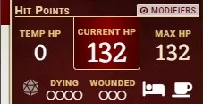
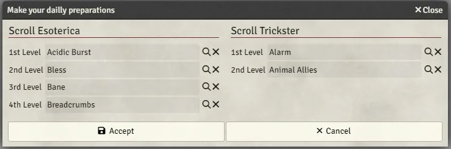
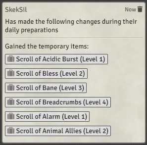

# FoundryVTT PF2e Dailies

This module will provide a convenient interface to handle a character's daily preparations if they have at least one of the following feats and automatically create the associated items:

-   [Ancestral Longevity](https://2e.aonprd.com/Feats.aspx?ID=12)
-   [Scroll Esoterica](https://2e.aonprd.com/Feats.aspx?ID=3713)
    -   [Elaborate Scroll Esoterica](https://2e.aonprd.com/Feats.aspx?ID=3720)
    -   [Grand Scroll Esoterica](https://2e.aonprd.com/Feats.aspx?ID=3730)
-   [Basic Scroll Cache](https://2e.aonprd.com/Feats.aspx?ID=2054)
    -   [Expert Scroll Cache](https://2e.aonprd.com/Feats.aspx?ID=2056)
    -   [Master Scroll Cache](https://2e.aonprd.com/Feats.aspx?ID=2057)

# Sheet Icon

A new character sheet icon will appear next to the `rest` one, clicking on it will open the daily preparations interface.

# Interface

The interface will look different depending on the feats present on the character and its current level.

The interface allows the user to open the compendium browser (with the right settings) and directly drag & drop the appropriate items.

## Scrolls

When a spell is dropped in a spell slot, a temporary spell scroll will be created with the appropriate hightened level directly in the character's inventory.

## Ancestral Longevity

The selected `skill` will automatically be ranked to `Trained`.

# Chat

A descriptive chat message will be created to indicate what have been prepared.

# CHANGELOG

You can see the changelog [HERE](./CHANGELOG.md)
